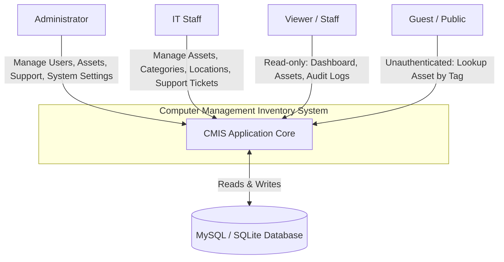
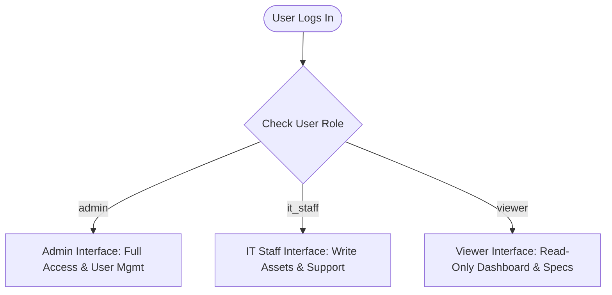

# System Documentation: Computer Management Inventory System (CMIS)

## 1. System Overview

### 1.1 Purpose
The **Computer Management Inventory System (CMIS)** is a web-based asset management and tracking application developed for the **Quezon City Public Employment Service Office (QC PESO)**. It replaces legacy manual spreadsheets with a unified, digital platform to track the full lifecycle of office computers and IT equipment—including hardware specifications, physical location assignments, organizational division ownership, maintenance logs, and audit logs.

### 1.2 Core Objectives
* **Hardware System of Record:** A single repository to catalog hardware specs (CPU, RAM, storage, OS, hostnames), serial numbers, warranty parameters, and financial records for all computing assets.
* **Accountability & Tracking:** Check-out and check-in workflows linking devices to specific users, tracking transfer dates, and recording returning conditions.
* **Technical Support Logs:** An incident management interface to track problems reported, repair actions taken, technician handlings, and resolution metrics.
* **Role-Based Access Control (RBAC):** Tiered system access dividing capabilities among Administrators (full control), IT Staff (write privileges for assets/tickets), and Viewers (read-only monitoring).
* **Activity & Audit Logging:** Automate tracking of all create, update, delete, and restore actions with complete snapshots of old and new data values.
* **Physical Verification Tools:** Support for printable asset labels and an unauthenticated public lookup portal using asset tags to verify details in real-time.

---

## 2. Technical Stack

| Layer | Technology |
| :--- | :--- |
| **Frontend** | Blade Template Engine, Tailwind CSS v4.0.0 (loaded via CDN and Vite for custom layout styling), Vanilla JavaScript, HTML5 |
| **Backend** | Laravel 12.0 (MVC architecture), Eloquent ORM, custom authentication session handlers, route middleware authorization |
| **Database** | SQLite (Default for development/local environment), MySQL (Supported for production deployment), InnoDB engine support, Soft Deletes |
| **Tooling** | Composer, npm, Vite, PHPUnit, Laravel Pint (code styling), Artisan CLI, Laravel Pail (log viewer), Laravel Sail (Docker setup) |

---

## 3. System Architecture

### 3.1 System Context Diagram (Level 0)



The system interfaces with four primary external entities:
1. **Viewer (Staff):** Accesses read-only dashboards, lists assets, views locations/divisions, and reviews audit logs.
2. **IT Staff:** Creates, updates, soft-deletes, and restores equipment records and logs technical support incidents.
3. **Admin:** Performs all IT Staff actions, plus full User Management (creating accounts, modifying roles, resetting passwords).
4. **Guest (Public):** Inspects equipment metadata through public asset tag query URLs without logging in.
5. **MySQL / SQLite Database:** Relational database engines utilized to store inventory, logging, session, and configuration data.

### 3.2 Presentation & Application Layers
* **Presentation Layer:** Formatted as a server-side rendered (SSR) layout using Blade templates. It utilizes a sticky sidebar, branded headers, and CSS utility variables configured via a Tailwind CDN. Dynamic visibility toggles remove action controls (such as "Create Asset" or "Edit Ticket") for read-only roles.
* **Application Layer:** Handled by Laravel 12.0 controller routing. Middleware checks (`EnsureUserHasRole`) guard modifying routes, returning `403 Forbidden` if unauthorized requests are attempted. Observers listen for Eloquent mutations to write entries to the Activity Log automatically.
* **Communication Interface:** Web interface routing handles standard HTTP requests, redirects, and session status messages. A REST API exists under `/api/v1` that delivers JSON payloads of assets, categories, and locations for potential internal tooling.

---

## 4. Database Design (ERD & Data Dictionary)

### 4.1 Entity Relationship Diagram (ERD) Logic
The CMIS database enforces relational integrity using foreign key relationships:

* **Users & Roles:** 
  * `users (1) ➔ assignments (N)`: A user acts as the assignee for multiple historical equipment check-outs.
  * `users (1) ➔ activity_logs (N)`: All actions logged in the system are attributed back to the performing user.
* **Assets & Classifications:**
  * `categories (1) ➔ assets (N)`: Every asset must belong to a defined equipment category (e.g., Desktop, Laptop).
  * `locations (1) ➔ assets (N)`: Assets are linked to a physical location (building, room).
  * `divisions (1) ➔ assets (N)`: Assets are assigned to an organizational division of QC PESO.
* **Assignments (Check-out/in):**
  * `assets (1) ➔ assignments (N)`: Assets track assignment history. An active assignment is marked by `returned_at` being null.
* **Divisions & Locations:**
  * `locations (1) ➔ divisions (N)`: Divisions belong to specific base locations.
* **Supplies & Locations:**
  * `locations (1) ➔ supplies (N)`: Office supplies are located in specific storerooms.

### 4.2 Data Dictionary

#### Table: `users`
| Column | Type | Nullable | Constraints | Description |
| :--- | :--- | :--- | :--- | :--- |
| `id` | bigint | No | PK, Autoincrement | Unique identifier for the user account. |
| `name` | varchar(255) | No | | Full name of the user. |
| `email` | varchar(255) | No | Unique | Email address used as the login credential. |
| `role` | enum | No | Default: `'viewer'` | Role defining access: `'admin'`, `'it_staff'`, `'viewer'`. |
| `email_verified_at`| timestamp | Yes | | Date and time the email was verified. |
| `password` | varchar(255) | No | | Hashed account password. |
| `remember_token` | varchar(100) | Yes | | Token for persistent "remember me" sessions. |
| `created_at` | timestamp | Yes | | Standard Laravel creation timestamp. |
| `updated_at` | timestamp | Yes | | Standard Laravel modification timestamp. |

#### Table: `assets`
| Column | Type | Nullable | Constraints | Description |
| :--- | :--- | :--- | :--- | :--- |
| `id` | bigint | No | PK, Autoincrement | Unique identifier for the asset. |
| `asset_tag` | varchar(255) | No | Unique | Unique identifier tag (e.g., CMP-0001). |
| `name` | varchar(255) | No | | Descriptive name (e.g., "Dell OptiPlex 7090"). |
| `category_id` | bigint | No | FK ➔ `categories` | Category classification. |
| `location_id` | bigint | Yes | FK ➔ `locations` | Physical storage or operating location. |
| `division_id` | bigint | Yes | FK ➔ `divisions` | Owner department division in QC PESO. |
| `brand` | varchar(255) | Yes | | Manufacturer brand. |
| `model` | varchar(255) | Yes | | Model name or number. |
| `serial_number` | varchar(255) | Yes | Unique | Hardware serial number. |
| `status` | enum | No | Default: `'available'` | Status: `'available'`, `'in_use'`, `'under_maintenance'`, `'defective'`, `'for_replacement'`. |
| `purchase_date` | date | Yes | | Date of hardware purchase. |
| `purchase_cost` | decimal(12,2) | Yes | | Equipment purchase cost. |
| `warranty_expiry` | date | Yes | | Warranty expiration date. |
| `specifications` | text | Yes | | General specs (free text). |
| `cpu` | varchar(255) | Yes | | CPU specs (e.g., Intel i7-11700). |
| `ram_total` | varchar(255) | Yes | | Installed system memory capacity. |
| `ram_used` | varchar(255) | Yes | | Active memory consumption (benchmark). |
| `storage_capacity`| varchar(255) | Yes | | Hard drive capacity (e.g., 512 GB). |
| `storage_device` | varchar(255) | Yes | | Storage media type (e.g., NVMe SSD). |
| `operating_system`| varchar(255) | Yes | | Installed OS (Windows, Linux, macOS). |
| `hostname` | varchar(255) | Yes | | Network host name identifier. |
| `utilized_by` | varchar(255) | Yes | | Primary end-user name (if applicable). |
| `ownership_type` | enum | No | Default: `'office_owned'` | Ownership model: `'office_owned'`, `'personally_owned'`. |
| `connectivity` | enum | No | Default: `'lan'` | Connectivity: `'lan'`, `'wifi'`, `'both'`, `'none'`. |
| `wifi_network` | varchar(255) | Yes | | Target SSID network name. |
| `condition` | enum | No | Default: `'good'` | Physical condition: `'good'`, `'fair'`, `'for_repair'`, `'unserviceable'`. |
| `software_installed`| text | Yes | | List of software packages. |
| `has_crowdstrike` | boolean | No | Default: `false` | Status of CrowdStrike security agent. |
| `notes` | text | Yes | | Administrative notes. |
| `created_at` | timestamp | Yes | | Record creation timestamp. |
| `updated_at` | timestamp | Yes | | Record modification timestamp. |
| `deleted_at` | timestamp | Yes | | Soft-deletion indicator timestamp. |

#### Table: `categories`
| Column | Type | Nullable | Constraints | Description |
| :--- | :--- | :--- | :--- | :--- |
| `id` | bigint | No | PK, Autoincrement | Category identifier. |
| `name` | varchar(255) | No | | Category name (e.g., "Desktop"). |
| `slug` | varchar(255) | No | | URL slug generated from name. |
| `description` | text | Yes | | Brief description of category. |
| `created_at` | timestamp | Yes | | Creation timestamp. |
| `updated_at` | timestamp | Yes | | Modification timestamp. |

#### Table: `locations`
| Column | Type | Nullable | Constraints | Description |
| :--- | :--- | :--- | :--- | :--- |
| `id` | bigint | No | PK, Autoincrement | Location identifier. |
| `name` | varchar(255) | No | | Location name (e.g., "HQ"). |
| `building` | varchar(255) | Yes | | Building name. |
| `floor` | varchar(255) | Yes | | Floor number. |
| `room` | varchar(255) | Yes | | Room designation. |
| `notes` | text | Yes | | Special access directions. |
| `created_at` | timestamp | Yes | | Creation timestamp. |
| `updated_at` | timestamp | Yes | | Modification timestamp. |

#### Table: `divisions`
| Column | Type | Nullable | Constraints | Description |
| :--- | :--- | :--- | :--- | :--- |
| `id` | bigint | No | PK, Autoincrement | Division identifier. |
| `location_id` | bigint | No | FK ➔ `locations` | Linked physical location. |
| `name` | varchar(255) | No | | Full division name. |
| `code` | varchar(255) | Yes | | Division shortcode (e.g., "PED", "LMISD"). |
| `description` | text | Yes | | Division responsibilities notes. |
| `created_at` | timestamp | Yes | | Creation timestamp. |
| `updated_at` | timestamp | Yes | | Modification timestamp. |

#### Table: `technical_supports`
| Column | Type | Nullable | Constraints | Description |
| :--- | :--- | :--- | :--- | :--- |
| `id` | bigint | No | PK, Autoincrement | Unique support log identifier. |
| `date` | timestamp | No | | Date of support request registry. |
| `division` | varchar(255) | Yes | | Target division affected. |
| `reported_by` | varchar(255) | Yes | | Name of person reporting issue. |
| `issue_problem` | text | No | | Description of hardware/software issue. |
| `action_taken` | text | Yes | | Troubleshooting action taken. |
| `handled_by` | varchar(255) | Yes | | Name of the responding technician. |
| `status` | enum | No | Default: `'in_progress'` | Status: `'in_progress'`, `'for_checking'`, `'failed'`, `'done'`. |
| `resolved_at` | timestamp | Yes | | Timestamp when problem was resolved. |
| `created_at` | timestamp | Yes | | Creation timestamp. |
| `updated_at` | timestamp | Yes | | Modification timestamp. |

#### Table: `activity_logs`
| Column | Type | Nullable | Constraints | Description |
| :--- | :--- | :--- | :--- | :--- |
| `id` | bigint | No | PK, Autoincrement | Unique audit log entry identifier. |
| `user_id` | bigint | Yes | FK ➔ `users` | User who executed the action. |
| `action` | varchar(255) | No | | Type of action: `created`, `updated`, `deleted`, `restored`. |
| `model_type` | varchar(255) | No | | Namespace of class (e.g. `App\Models\Asset`). |
| `model_id` | bigint | No | | Key identifier of mutated entity. |
| `model_label` | varchar(255) | No | | Readable label of mutated entity. |
| `description` | text | No | | Narrative summary of change. |
| `old_values` | json | Yes | | JSON payload of values before update. |
| `new_values` | json | Yes | | JSON payload of values after update. |
| `ip_address` | varchar(255) | Yes | | IP address of matching request client. |
| `created_at` | timestamp | No | | Event timestamp. |

#### Table: `assignments`
| Column | Type | Nullable | Constraints | Description |
| :--- | :--- | :--- | :--- | :--- |
| `id` | bigint | No | PK, Autoincrement | Assignment record identifier. |
| `asset_id` | bigint | No | FK ➔ `assets` | Checked-out hardware asset. |
| `user_id` | bigint | No | FK ➔ `users` | Target employee receiving asset. |
| `assigned_by` | bigint | Yes | FK ➔ `users` | Operator dispatching asset. |
| `assigned_at` | timestamp | No | | Handout timestamp. |
| `returned_at` | timestamp | Yes | | Return timestamp (null if still checkout). |
| `condition_on_return`| text | Yes | | Notes describing hardware return shape. |
| `notes` | text | Yes | | Assignment comments. |
| `created_at` | timestamp | Yes | | Creation timestamp. |
| `updated_at` | timestamp | Yes | | Modification timestamp. |

#### Table: `supplies` (Stub)
| Column | Type | Nullable | Constraints | Description |
| :--- | :--- | :--- | :--- | :--- |
| `id` | bigint | No | PK, Autoincrement | Supply item identifier. |
| `name` | varchar(255) | No | | Stock item name (e.g., "RJ45 Plugs"). |
| `sku` | varchar(255) | Yes | Unique | Inventory SKU identifier code. |
| `location_id` | bigint | Yes | FK ➔ `locations` | Storage location. |
| `quantity_on_hand`| integer | No | Default: 0 | Current stock volume. |
| `reorder_level` | integer | No | Default: 0 | Low inventory alarm trigger point. |
| `unit` | varchar(30) | No | Default: `'pcs'` | Quantity units (pcs, boxes, rolls). |
| `notes` | text | Yes | | Inventory comments. |
| `created_at` | timestamp | Yes | | Creation timestamp. |
| `updated_at` | timestamp | Yes | | Modification timestamp. |

---

## 5. Functional Modules

### 5.1 Authentication & User Management
* **Web Session Auth:** Handled in a standalone `LoginController` using native Laravel session authentication. Requires an email and password credential set.
* **Role System:** Three strict database enums govern permissions: `admin`, `it_staff`, and `viewer`.
* **Guard Middleware:** Modifying routes require the `EnsureUserHasRole` middleware (assigned as `role` in the bootstrap). Reaching a protected write route without these permissions terminates execution with a `403 Forbidden` error.

### 5.2 Dashboard
* **Metrics Summary:** Compiles quick-stat counts of total system assets and breakdowns by condition (`good`, `fair`, `for_repair`, `unserviceable`).
* **Category Distribution:** Displays a table of assets grouped by hardware category types, sorted descending by volume.
* **Warranty Expansions:** Displays a table listing the 5 closest hardware records with warranties expiring within 60 days.
* **Technical Support Alerts:** Exposes the 5 most recent tickets that remain open (`in_progress` or `for_checking`).
* **Action Center:** Highlights counts of pending support tickets, expiring warranty assets, and active repair hardware needing staff focus.

### 5.3 Asset Management (Equipment Records)
* **Creation & Profile Management:** Standard form to input inventory identifiers (Asset Tag, Serial, Name, Category, Location, Division, Cost) and technical specifications (CPU, total/used RAM, storage capacity, operating systems, connectivity details).
* **Asset Code Generator:** Automatically increments tag values. The system queries soft-deleted records to calculate the next tag index (e.g., `CMP-0026`) preventing duplicate label collisions.
* **Mass Operations:** Admin/IT Staff can select multiple assets from index lists for bulk soft-deletion or bulk permanent-deletion.
* **Public Asset Lookup:** A public portal route (`/assets/lookup/{tag}`) permits external staff to input an asset tag and review operational status, specs, and owner details without logging in.

### 5.5 Category, Location, and Division Management
* **Classifications CRUD:** Interfaces to establish and modify categories with automatic slug generation (e.g., "Desktop Computer" ➔ "desktop-computer").
* **Locations CRUD:** Setup physical zones (building, floor, room) to link physical environments to equipment locations.
* **PESO Divisions:** Maps the 8 administrative PESO departments:
  * **PED:** Placement and Employment Division
  * **LMISD:** Labor Market Information and Statistics Division
  * **ADMIN:** Administrative Division
  * **SPD:** Special Programs Division
  * **OPM:** Office of the Public Employment Manager
  * **LRSD:** Labor Relations and Standards Division
  * **DOC:** Documentation and Records
  * **MSD:** Management and Support Division

### 5.4 Technical Support / Ticket System
* **Incident Registry:** Operators log support events detailing date, division, reporter name, problem statement, troubleshooting action taken, and responding tech.
* **Status States:** Support tickets route through a lifecycle status system: `in_progress` ➔ `for_checking` ➔ `failed` ➔ `done`. 
* **Asset Syncing:** (Planned integration) Resolving ticket issues resets target assets to `available`, while opening tickets can move assets to `under_maintenance`.

### 5.6 Assignments & Audit Logging
* **Equipment Checkout:** The `AssignmentController` contains logic to assign `available` hardware assets to users, changing status to `in_use` and recording expected returns.
* **Equipment Check-in:** Processes returned equipment, tracking dates, return conditions, and returning status back to `available`.
* > [!NOTE]
  > The assignment controller and layout templates exist in the codebase but their web routes are not mapped in the active `routes/web.php` configuration.
* **Activity Observer:** The `ActivityLog` schema records database operations (`created`, `updated`, `deleted`, `restored`) across models, capturing user IDs, execution timestamps, client IP addresses, and JSON snapshots of `old_values` and `new_values`.

### 5.7 Reports (Phase 3 Status)
* **Report Processor:** `ReportController` computes statistics including asset condition ratios, CrowdStrike deployment totals, financial values, warranty buckets, and technical support ticket resolution averages.
* > [!IMPORTANT]
  > The report controller and blade templates are ready, but routes are currently not mapped in `routes/web.php`. Re-registering the route will expose this module in navigation.

### 5.8 Office Supplies (Phase 3 Status)
* **Supply Inventory:** Database migrations exist to track consumable stock (SKU, quantity on hand, unit types, reorder values) at specific locations.
* > [!IMPORTANT]
  > Controller classes and front-end interface blades are not yet implemented.

---

## 6. API & Endpoint Specifications

All API routes are prefixed by `/api/v1/`. In the current Phase 1 implementation, API resources are open for internal network scripts. In Phase 2, they will be wrapped with `auth:sanctum` middleware.

### 6.1 Authentication Web Routes
| Method | Endpoint | Role Allowed | Description |
| :--- | :--- | :--- | :--- |
| `GET` | `/login` | Public | Displays the login form interface. |
| `POST` | `/login` | Public | Authenticates credentials and logs the user in. |
| `POST` | `/logout` | Authenticated | Terminates user session and logs the user out. |

### 6.2 Asset & Inventory Web Routes
| Method | Endpoint | Role Allowed | Description |
| :--- | :--- | :--- | :--- |
| `GET` | `/assets` | Authenticated | Lists all assets with search and filter controls. |
| `GET` | `/assets/create` | admin, it_staff | Displays form to add a new asset. |
| `POST` | `/assets` | admin, it_staff | Validates and stores new asset details. |
| `GET` | `/assets/{asset}` | Authenticated | Displays comprehensive specifications of an asset. |
| `GET` | `/assets/{asset}/edit` | admin, it_staff | Displays modification form for an asset. |
| `PUT` | `/assets/{asset}` | admin, it_staff | Validates and updates asset specs. |
| `DELETE`| `/assets/{asset}` | admin, it_staff | Soft-deletes asset, sending it to trash. |
| `GET` | `/assets/trash` | Authenticated | Displays list of soft-deleted assets in trash. |
| `POST` | `/assets/{asset}/restore`| admin, it_staff | Restores a soft-deleted asset from trash. |
| `DELETE`| `/assets/{asset}/force-delete`| admin, it_staff | Permanently deletes an asset record. |
| `POST` | `/assets/bulk-destroy` | admin, it_staff | Soft-deletes a selected array of assets. |
| `POST` | `/assets/bulk-force-delete`| admin, it_staff | Permanently deletes a selected array of assets. |
| `GET` | `/assets/export` | Authenticated | Exports filtered asset data as a CSV spreadsheet. |
| `GET` | `/assets/{asset}/label` | Authenticated | Displays printable barcode label for physical tagging. |
| `GET` | `/assets/lookup/{tag}` | Public | Unauthenticated spec lookup by asset tag. |

### 6.3 Technical Support Web Routes
| Method | Endpoint | Role Allowed | Description |
| :--- | :--- | :--- | :--- |
| `GET` | `/technical-support` | Authenticated | Lists all logged support incidents. |
| `GET` | `/technical-support/create`| admin, it_staff | Form to log a new technical support issue. |
| `POST` | `/technical-support` | admin, it_staff | Stores a new support log entry. |
| `GET` | `/technical-support/{id}/edit`| admin, it_staff | Edit form for an incident. |
| `PUT` | `/technical-support/{id}` | admin, it_staff | Updates ticket details, status, or resolution notes. |
| `DELETE`| `/technical-support/{id}`| admin, it_staff | Deletes support log record from system. |

### 6.4 Resource Management Web Routes
| Method | Endpoint | Role Allowed | Description |
| :--- | :--- | :--- | :--- |
| `GET` | `/categories` | Authenticated | Lists all equipment category models. |
| `POST` | `/categories` | Authenticated | Creates a new category class. |
| `GET` | `/categories/{category}/edit`| Authenticated | Edit form for category classifications. |
| `PUT` | `/categories/{category}` | Authenticated | Updates category description. |
| `DELETE`| `/categories/{category}` | Authenticated | Removes category class. |
| `GET` | `/locations` | Authenticated | Lists physical spaces, rooms, and facilities. |
| `POST` | `/locations` | Authenticated | Stores a new location space. |
| `GET` | `/locations/{location}/edit`| Authenticated | Edit details of a physical location. |
| `PUT` | `/locations/{location}` | Authenticated | Updates location parameters. |
| `DELETE`| `/locations/{location}` | Authenticated | Deletes a physical location space. |
| `GET` | `/divisions` | Authenticated | Lists administrative PESO divisions. |
| `POST` | `/divisions` | Authenticated | Adds a new PESO division. |
| `GET` | `/divisions/{division}/edit`| Authenticated | Edit division metadata. |
| `PUT` | `/divisions/{division}` | Authenticated | Updates division information. |
| `DELETE`| `/divisions/{division}` | Authenticated | Removes a PESO division. |

### 6.5 User Management Web Routes
| Method | Endpoint | Role Allowed | Description |
| :--- | :--- | :--- | :--- |
| `GET` | `/users` | admin | Lists user accounts with role designations. |
| `POST` | `/users` | admin | Creates a new user login account. |
| `GET` | `/users/{user}/edit` | admin | Edit form to modify user roles and names. |
| `PUT` | `/users/{user}` | admin | Updates user account configurations. |
| `DELETE`| `/users/{user}` | admin | Removes a user's access account. |

### 6.6 REST API (v1 JSON Endpoints)
| Method | Endpoint | Auth | Description |
| :--- | :--- | :--- | :--- |
| `GET` | `/api/v1/assets` | Public / Sanctum | Returns JSON array of all assets. |
| `POST` | `/api/v1/assets` | Public / Sanctum | Creates an asset via JSON payload. |
| `GET` | `/api/v1/assets/{id}` | Public / Sanctum | Returns JSON details of specific asset. |
| `PUT` | `/api/v1/assets/{id}` | Public / Sanctum | Updates asset properties via JSON payload. |
| `DELETE`| `/api/v1/assets/{id}` | Public / Sanctum | Soft-deletes asset via API. |
| `GET` | `/api/v1/categories` | Public / Sanctum | Returns JSON array of categories. |
| `POST` | `/api/v1/categories` | Public / Sanctum | Creates a category via JSON. |
| `GET` | `/api/v1/categories/{id}`| Public / Sanctum | Returns JSON details of specific category. |
| `PUT` | `/api/v1/categories/{id}`| Public / Sanctum | Updates category details via API. |
| `DELETE`| `/api/v1/categories/{id}`| Public / Sanctum | Deletes category via API. |
| `GET` | `/api/v1/locations` | Public / Sanctum | Returns JSON array of locations. |
| `POST` | `/api/v1/locations` | Public / Sanctum | Creates a location via JSON. |
| `GET` | `/api/v1/locations/{id}` | Public / Sanctum | Returns JSON details of specific location. |
| `PUT` | `/api/v1/locations/{id}` | Public / Sanctum | Updates location details via API. |
| `DELETE`| `/api/v1/locations/{id}` | Public / Sanctum | Deletes location via API. |

---

## 7. Role-Based User Manual

The Computer Management Inventory System enforces role separation to protect data integrity:



### 7.1 Administrator (admin)
* **Access Level:** Unrestricted access to all views (Dashboard, Assets, Categories, Locations, Divisions, Technical Support, Audit Logs, and User Management).
* **Account Control:** Only Admins can register new users, change roles, or update passwords.
* **Relational Control:** Full permission to execute bulk deletes and permanent force-deletes. Soft-deleted assets can be recovered from the Trash view.

### 7.2 IT Staff (it_staff)
* **Access Level:** Read/write permissions for assets, categories, locations, divisions, and technical support. Read-only permissions for the Dashboard and Audit Logs.
* **Account Control:** No access to User Management. Attempts to access user paths return `403 Forbidden` response pages.
* **Relational Control:** IT Staff can create and edit assets or log support tickets. They can soft-delete assets, but cannot execute permanent force-deletes.

### 7.3 Viewer (viewer)
* **Access Level:** Read-only access to the Dashboard, Assets, Categories, Locations, Divisions, Technical Support, and Audit Logs.
* **Action Restrictions:** All modification controls (buttons such as "Create", "Edit", "Delete", "Export") are hidden. Attempting to visit editing routes manually causes the route middleware to trigger a `403 Forbidden` response.

### 7.4 Public / Guest (unauthenticated)
* **Access Level:** Only the login interface and the asset tag lookup page are accessible.
* **Route Redirects:** Any attempt to reach internal authenticated pages redirects the client back to the `/login` route.

### 7.5 Shared Session Characteristics
* **Security Lifetime:** Session variables timeout after 120 minutes of inactivity (configured via `SESSION_LIFETIME` in `.env`).
* **CSRF Protection:** Laravel CSRF tokens secure all POST, PUT, and DELETE actions. The `/logout` endpoint is exempt from CSRF validation to allow quick session termination.

---

## 8. Deployment & Setup

### 8.1 System Requirements
* **Runtime:** PHP 8.2+
* **Package Managers:** Composer (PHP dependencies), npm (JavaScript build systems)
* **Database Engine:** SQLite (configured) or MySQL 5.7+

### 8.2 Installation Steps

1. **Get Code & Navigate:**
   ```bash
   cd c:\Users\JulianaTiro\cmis
   ```

2. **Install PHP Packages:**
   ```bash
   composer install
   ```

3. **Configure Environment:**
   Duplicate the template file and configure database variables.
   ```bash
   copy .env.example .env
   ```
   *Note: For default SQLite development, ensure `DB_CONNECTION=sqlite` is defined in `.env` and create the blank database file:*
   ```bash
   # Windows PowerShell
   New-Item -ItemType File -Path database\database.sqlite -Force
   ```

4. **Generate Application Key:**
   ```bash
   php artisan key:generate
   ```

5. **Run Migrations & Seed Data:**
   Run migrations to set up the database tables, followed by the seeders to populate initial data.
   ```bash
   php artisan migrate
   ```
   *Seeding core classifications, divisions, locations, and 25 sample computers:*
   ```bash
   php artisan db:seed --class=DatabaseSeeder
   ```
   *Seeding system user accounts (admin@example.com, staff@example.com, viewer@example.com - all using password "password"):*
   ```bash
   php artisan db:seed --class=UserSeeder
   ```

6. **Install and Build Frontend Assets:**
   Install npm dependencies and run the build command.
   ```bash
   npm install
   ```
   ```bash
   npm run build
   ```

7. **Start the Development Server:**
   Serve the application locally using Artisan.
   ```bash
   php artisan serve
   ```
   The application will be accessible at: `http://localhost:8000`.
